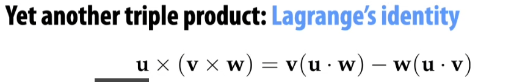
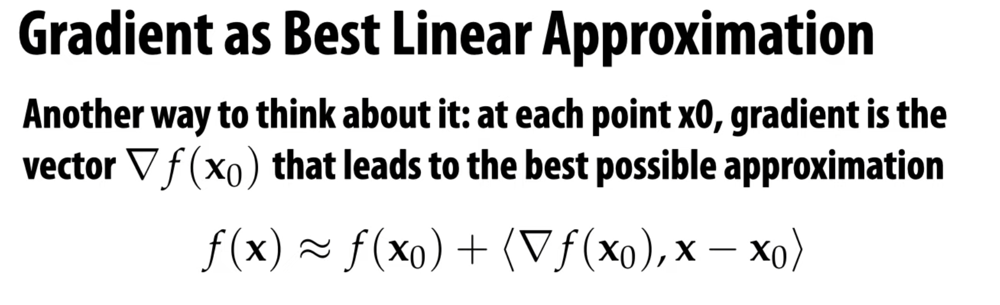
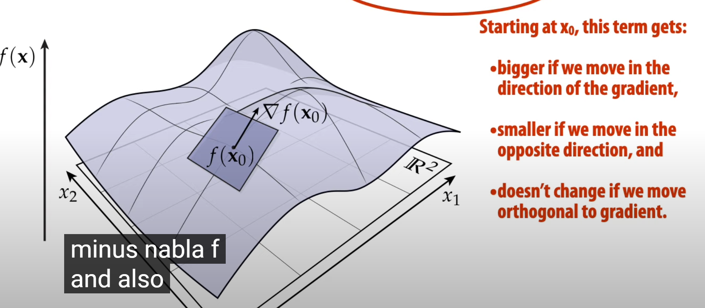
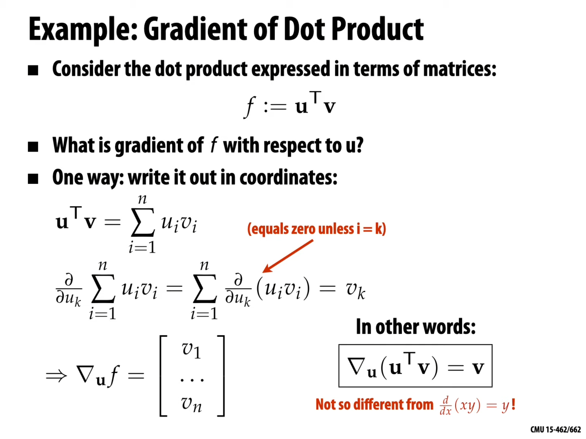
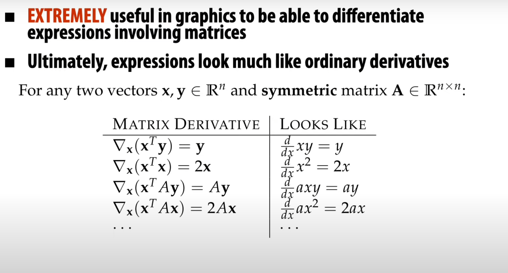

## Inner Product的矩阵形式

有限维度内积空间的内积都有如下形式

\[(\alpha,\beta) = \alpha^{T} A \beta = X^T G \bar{Y}\]
其中$G$是Hermite矩阵. 实际上在欧几里得空间中都是对称矩阵. 

## Cross Product的矩阵形式
这里略注意是反对称矩阵.

## Triple Product混合积

\[[a,b,c] = (a\times b)\cdot c = \det(A)\]
这也解释了其几何意义, 为什么是体积. 以及线性变换的伸缩比例.

## Lagrange 等式

## Gradient
方向导数最大的方向就是梯度.
\[\nabla f(a,b) = (f_x(a,b), f_y(a,b))\]

这里可以看华师大的方向导数
\[f_u(x) = \nabla f(x) \cdot u\]

考虑将$A$分解为$E_{ij}$然后考虑一个单位, 最后含有$x_k$平方项的系数为1, 一次项的系数为2. 显然得到.