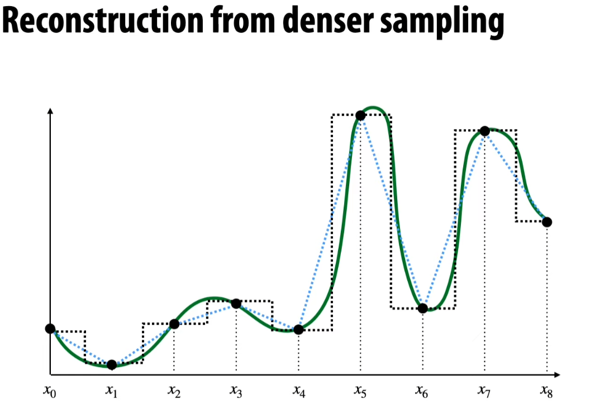
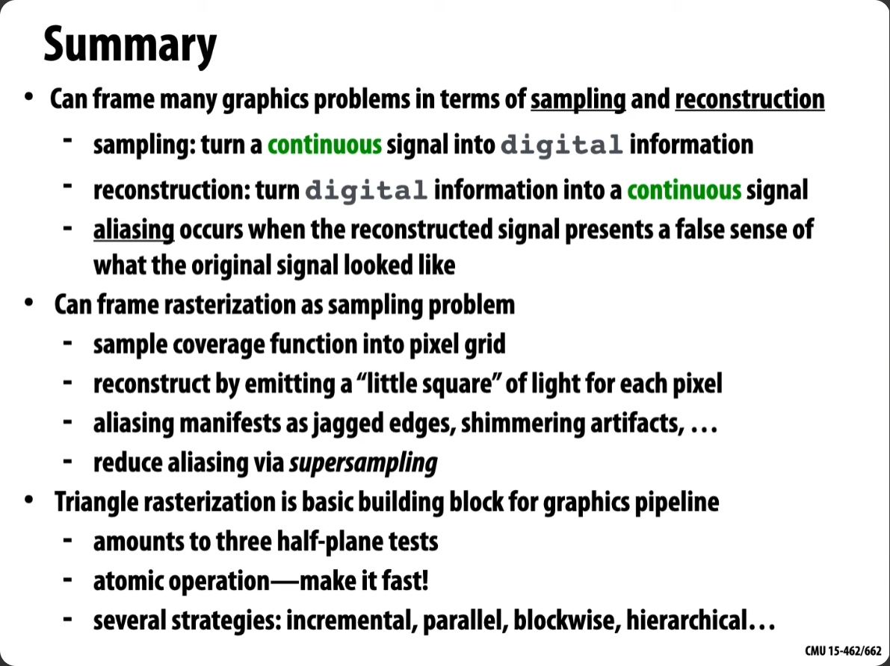

## 画三角形

- 根据覆盖范围调整颜色亮度

- 但实际上情况比较复杂，计算出来准确的coverage是不现实的，往往转变为采样问题

## 采样

基本方法，附近直接代替，precise constant

使用线性插值法

使用更密集的采样，不同reconstruction方式不同的结果如上图

光栅化过程中，是对覆盖方程进行采样

采样也存在一些边界情况

当然也存在解决方案, 可以见图片中给出的链接.

1D信号可以理解为不同频率的叠加.

undersample高频信号会导致 **失真.**

 ## frequencies

图片被分解为频域, 右图是一个频谱. 白色意味着更大的amplitude. 

经过低通滤波器处理, 去掉了高频信号

保留中间频率的

只保留高频信号

不同频域叠加.

典型的失真, 过高的频率导致undersample. 比如wagon wheel effect. 

## 采样定理/香农定理

如果一个连续时间信号的带宽为$B Hz$（赫兹），那么为了完全避免信息丢失，我们需要以至少2B个样本每秒的速率对其进行采样。这意味着信号的最高频率成分的两倍采样率是必要的，以便能够准确地重构原始信号。

## 经典问题, 如何判断点是否在三角形内部

- 向量与基的方法
\[ \vec{AP} = \lambda \vec{AP} + \mu \vec{AP}, 
\lambda \in (0,1), \mu \in (0,1), \lambda + \mu < 1 .
\]

- 叉乘
\[\vec {AP} \times \vec{AB},
\vec {BP} \times \vec{BC},
\vec {CP} \times \vec{CA},
\], 只要方向相同即可

- 在直线的上方与下方
找到三条直线, 判断是不是在这个区域之中, 不建议使用斜率方法. 

## 对三角形采样
#### 使用特定区域进行加速. 

但是如今的计数足够支持test这个bounding box, 并行计算克服了多余test的缺点. 

但是极端情况仍然棘手

#### 采用混合的解决方案: 

每次首先测试大的放方块. 只需解决正方形是否在三角形内的问题, 以及是否与其相交的问题. 但是仍然不够方便

#### Hierarchical 策略
1. 是否整个三角形都在屏幕上
2. 判断是否大区域相交
, 如果相交再切成更小的box 
, 
甚至更小

最终停止在一个度量

## Summary
