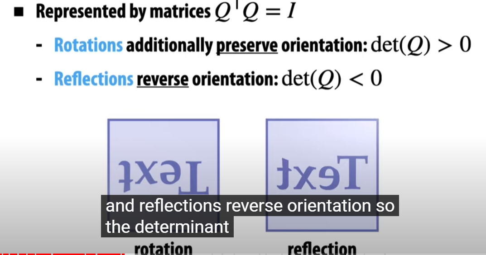

## Transformation

- #####  这是一个$3\times3$矩阵模板
\[
\begin{bmatrix}
1 & 1 & 1 \\
2 & 2 & 2 \\
3 & 3 & 3
\end{bmatrix}
\]
- #####  这是一个$2\times2$矩阵模板
\[
\begin{bmatrix}
\cos \theta & -\sin \theta \\
\sin \theta & \cos \theta
\end{bmatrix}
\]
- #####  这是一个$2\times1$矩阵模板
\[
\begin{bmatrix}
\cos \theta\\
\sin \theta 
\end{bmatrix}
\]
\[
\begin{bmatrix}
0\\1
\end{bmatrix}
\]

#### Transformation

人类对其直觉, 就是源于这些不变性. 

### Rotation
preserve orientation, distances, origin fixed. 
##### 2D rotation : 

\[
f_{\theta}(\mathbf{X}) = \begin{bmatrix}
\cos \theta & -\sin \theta \\
\sin \theta & \cos \theta
\end{bmatrix}\mathbf{X}
\]
从一组基开始考虑
\[
    \begin{bmatrix}
1\\0 \end{bmatrix} \rightarrow
\begin{bmatrix}
\cos \theta\\
\sin \theta 
\end{bmatrix},     \begin{bmatrix}
0\\1 \end{bmatrix} \rightarrow
\begin{bmatrix}
-\sin \theta \\
\cos \theta
\end{bmatrix}, 
\]
再考虑$x = x_1 \begin{bmatrix}
1\\0
\end{bmatrix} + x_2 \begin{bmatrix}
0\\1
\end{bmatrix}$
利用基的线性映射, 于是就有
\[f(x) = x_1 \begin{bmatrix}
\cos \theta \\\sin\theta
\end{bmatrix} + x_2 \begin{bmatrix}
-\sin\theta\\\cos\theta
\end{bmatrix}\]
后续自然平凡

##### 3D rotation
\[
R_x(\theta) =
\begin{bmatrix}
1 & 0 & 0 \\
0 & \cos\theta & -\sin\theta \\
0 & \sin\theta & \cos\theta
\end{bmatrix}
\]
\[
R_y(\theta) =
\begin{bmatrix}
\cos\theta & 0 & \sin\theta \\
0 & 1 & 0 \\
-\sin\theta & 0 & \cos\theta
\end{bmatrix}
\]
\[
R_z(\theta) =
\begin{bmatrix}
\cos\theta & -\sin\theta & 0 \\
\sin\theta & \cos\theta & 0 \\
0 & 0 & 1
\end{bmatrix}
\]

**旋转矩阵是正交矩阵**
保持了**origin fixed, distances, orientation**, 这正是保证了内积的性质. 回顾之前所学, **保内积线性映射等价于保长线性映射.**
并且注意到变换把**标准正交基映射为标准正交基**, 这也是正交变换的等价性质. 
\[Q^*Q = Q^TQ = I\]
将其分类, $\det^2 Q = 1, \det Q = 1 \ \textbf{or} -1$
前者是preserve orientation, 而后者reserve orientation

### Scaling

\[f_a(X) = aIX\]

注意negative scalinig, 会同时反转上下方向

这里实际上是三个方向分别反转的分解

\[f(X) = \begin{bmatrix}
a & 0 & 0 \\
0 & b & 0 \\
0 & 0 & c
\end{bmatrix}X\]

惊奇地发现这是一个**对称阵.** 反过来呢 ? 

是的, 恰好是其特征值! 

### Shear

考虑二维的shear
\[
\begin{bmatrix}
1 & s_x \\
0 & 1
\end{bmatrix} \quad 
\begin{bmatrix}
1 & 0 \\
s_y & 1
\end{bmatrix}
\]
考虑三维的shear
\[
\begin{bmatrix}
1 & 0 & s_x \\
0 & 1 & s_y \\
0 & 0 & 1
\end{bmatrix}
\quad
\begin{bmatrix}
1 & 0 & s_x & 0\\
0 & 1 & s_y & 0\\
0 & 0 & 1 & 0\\
0 & 0 & 0 & 1
\end{bmatrix}
\]

### Decompisition of linear tranform

**类似于QR分解! 找到了归宿 , 这里是LU分解**

### 线性插值

### Polar分解

这列不能使用线性插值, 得到的可能不是个

插值的应用, 避免这种candy效果

### Translation
non-linear. 这正是齐次坐标地诞生之处

### Homogeneous Coordinates

这一条线所有的都可以代表他

实际上仔细画个可以发现, 这个线是从 $(0,0)$ 印出来的, 也就是任何在 $\vec{p} = (x,y,1)$ 这条向量上的点都是 $P$

接下来考虑平移变换

\[  u = (u_1, u_2) \\
    p=(p_1,p_2) \rightarrow p\prime = (p_1 + u_1, p_2 + u_2) \]

在齐次坐标中: 
\[
    \hat{p} = (cp_1, cp_2, c) \rightarrow \hat{p}\prime = (cp_1 + cu_1, cp_2 + cu_2, c)
    \]

考虑shear变换:
$v = (0, 0, 1), u = (u_1, u_2, 0)$
得到矩阵表示:
\[
\begin{bmatrix}
1 & 0 & u_1 \\
0 & 1 & u_2 \\
0 & 0 & 1
\end{bmatrix}\]
三维的平移齐次坐标如下: 
\[
\begin{bmatrix}
1 & 0 & 0 & u_x\\
0 & 1 & 0 & u_y\\
0 & 0 & 1 & u_z\\
0 & 0 & 0 & 1
\end{bmatrix} = 
\begin{bmatrix}
u_x\\
u_y\\
u_z\\
1
\end{bmatrix} \begin{bmatrix}0 & 0 & 0 & 1\end{bmatrix} = u v^T
\]
验证其正确性是显然的. 
其他的齐次坐标表示是平凡的. 

#### Vector & Points

因此对于Vector的最后维度应该是0, 因为Vector不应该被平移, 第4维的1影响了Vector的平移, 因此Point应该是1, 并且Point-Point得到Vecor也是符合认知的.

#### Projective Projection In Homogeneous Coordinates

\[(x,y,z) \rightarrow (x/z,y/z)\]
注意这个z应该是负值, 

### Screen Transformation

平移变换, 移动原点:
\[
\begin{bmatrix}
1 & 0 & 1 \\
0 & 1 & -1 \\
0 & 0 & 1
\end{bmatrix}
\]
伸缩变换:
\[
\begin{bmatrix}
W/2 & 0 & 0 \\
0 & -H/2 & 0 \\
0 & 0 & 1
\end{bmatrix}
\]
\[
   \begin{bmatrix}
W/2 & 0 & 0 \\
0 & -H/2 & 0 \\
0 & 0 & 1
\end{bmatrix} 
    \begin{bmatrix}
1 & 0 & 1 \\
0 & 1 & -1 \\
0 & 0 & 1
\end{bmatrix} = 
\begin{bmatrix}
W/2 & 0 & W/2 \\
0 & -H/2 & H/2 \\
0 & 0 & 1
\end{bmatrix}
\]
注意对角阵的乘法的简便运算. 注意顺序, 因为变换往往是不可交换的. 

### Scene Graph

### Summary

